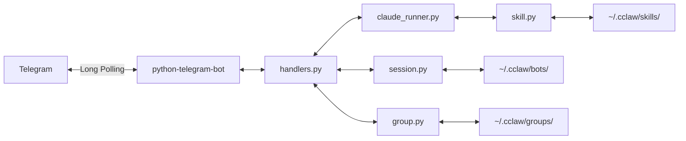
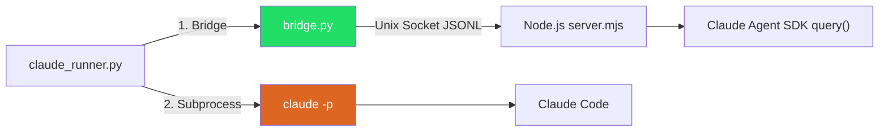
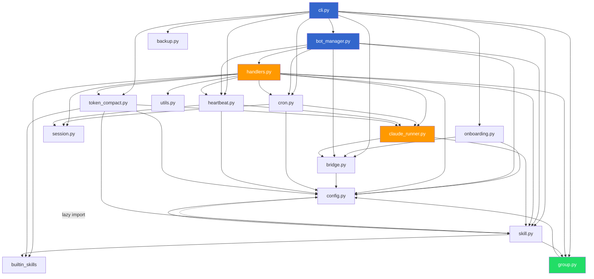
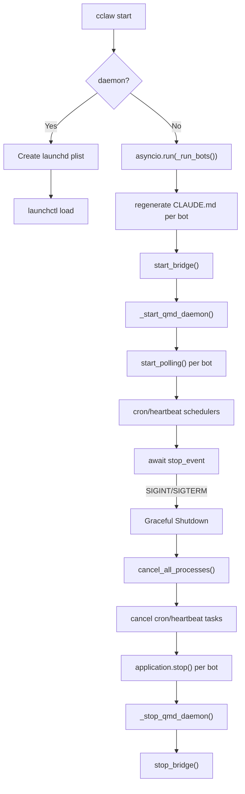
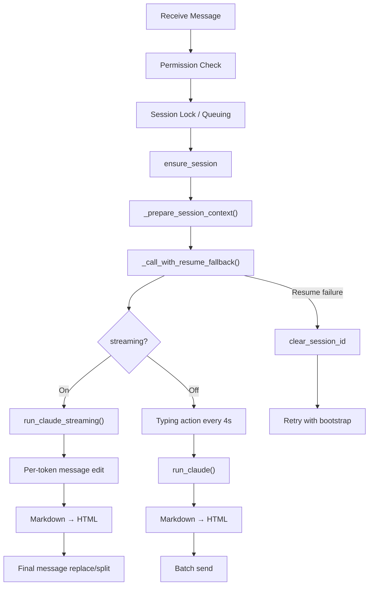
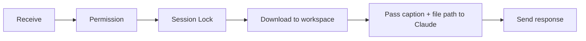
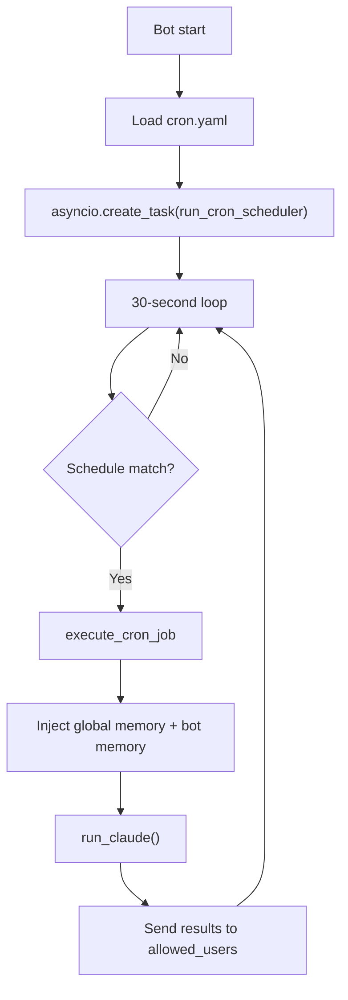
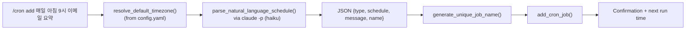
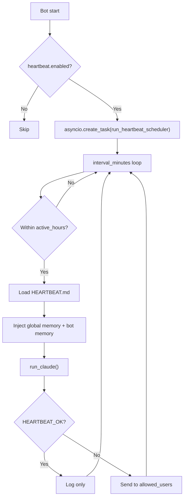
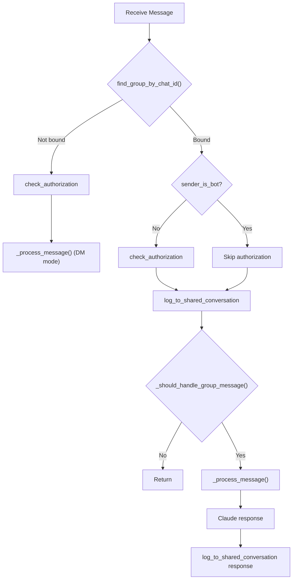

# Architecture

## Overall Structure



### Claude Code Execution Paths



## Core Design Decisions

### 1. Claude Code Subprocess Delegation

Instead of calling the LLM API directly, we run the `claude -p` CLI as a subprocess.

- Leverages Claude Code's agent capabilities (file manipulation, code execution) as-is
- No API key management needed (Claude Code handles its own authentication)
- Sets session directory as working directory via subprocess `cwd` parameter
- Model selection via `--model` flag (sonnet/opus/haiku)

### 2. Node.js Bridge (Claude Agent SDK)

A long-lived Node.js process runs Claude Code queries via the Agent SDK's v1 `query()` function, communicating with Python over a Unix socket using JSONL protocol.

- **Purpose**: Avoids spawning a new `claude` process per message. The bridge keeps a single Node.js runtime alive
- **Architecture**: `bridge.py` (Python client) <-> Unix socket (`/tmp/cclaw-bridge.sock`) <-> `server.mjs` (Node.js server) <-> `@anthropic-ai/claude-agent-sdk` `query()`
- **Lifecycle**: `bot_manager.py` calls `start_bridge()` before polling, `stop_bridge()` on shutdown
- **Auto-install**: `_bridge_directory()` copies bundled `bridge_data/` files to `~/.cclaw/bridge/` and runs `npm install` on first start. `server.mjs` is always overwritten to pick up fixes
- **Fallback**: If bridge is unavailable (not started, connection error), `claude_runner.py` transparently falls back to `claude -p` subprocess execution
- **Session retry**: If a stale session ID causes an error, bridge automatically retries without session options
- **Pipe draining**: Background daemon threads drain stdout/stderr to prevent buffer overflow
- **Doctor**: `cclaw doctor` shows bridge process status, socket connectivity, and SDK version
- **SDK v2 note**: `unstable_v2_createSession`/`unstable_v2_prompt` exist but do NOT support CLAUDE.md or Bash tools (alpha API). Will be reconsidered when v2 matures. See: https://platform.claude.com/docs/en/agent-sdk/typescript-v2-preview

### 3. File-Based Sessions

Sessions are managed via directory structure without a database.

- Each chat is a `chat_<id>/` directory
- `CLAUDE.md`: System prompt read by Claude Code
- `conversation-YYMMDD.md`: Daily conversation log (UTC date rotation, markdown append). Legacy `conversation.md` supported as read fallback
- `workspace/`: File storage for Claude Code outputs

### 4. Bot Configuration (bot.yaml)

Each bot's configuration is stored in `~/.cclaw/bots/<name>/bot.yaml`.

```yaml
telegram_token: "123456:ABCDEF"    # Telegram Bot API token
telegram_username: "@my_bot"       # Bot username (from Telegram API)
telegram_botname: "My Bot"         # Bot display name (from Telegram API)
display_name: "My Assistant"       # User-facing friendly name
personality: "Friendly helper"     # Personality description (used in CLAUDE.md)
role: "General assistant"          # What the bot does (used in CLAUDE.md)
goal: "Help with daily tasks"     # Why the bot exists (used in CLAUDE.md, optional)
allowed_users: []                  # Telegram user IDs (empty = allow all)
claude_args: []                    # Extra CLI args for claude -p
model: sonnet                      # Claude model (sonnet/opus/haiku, runtime-added)
streaming: false                   # Streaming response mode
skills:                            # Attached skill names (runtime-added)
  - imessage
  - reminders
heartbeat:                         # Heartbeat config
  enabled: false
  interval_minutes: 30
  active_hours:
    start: "07:00"
    end: "23:00"
```

### 5. Multi-Bot Architecture

Multiple Telegram bots run simultaneously in a single process.

- Independent `Application` instance per bot
- Concurrent polling via `asyncio`
- Per-bot independent configuration (token, personality, role, permissions, model)
- Individual bot errors are isolated from other bots

### 6. Per-Session Concurrency Control

Sequential processing when multiple messages arrive in the same chat.

- `asyncio.Lock` managed by `{bot_name}:{chat_id}` key
- When lock is held, sends "Message queued" notification then waits (message queuing)

### 7. Process Tracking

Running Claude Code subprocesses are tracked per session.

- `_running_processes` dictionary maps `{bot_name}:{chat_id}` to subprocess
- `/cancel` command kills running process with SIGKILL
- `returncode == -9` raises `asyncio.CancelledError`

### 8. Model Selection

Per-bot Claude model configuration with runtime changes.

- Stored in `bot.yaml`'s `model` field (default: sonnet)
- Runtime change via Telegram `/model` command (immediately saved to bot.yaml)
- Also changeable via CLI `cclaw bot model <name> <model>`
- Valid models: sonnet (4.5), opus (4.6), haiku (3.5) — `/model` shows version alongside name

### 9. Skill System

Extends bot capabilities by linking tools/knowledge. Skills are classified by origin:

- **Built-in skills** (`builtin`): Pre-packaged with cclaw, installable via `cclaw skills install <name>`
- **Custom skills** (`custom`): User-created via `cclaw skills add`

Internally, skills have different tool configurations:

- Minimum skill unit: folder + single `SKILL.md`
- **Markdown-only skills**: Just `SKILL.md` makes it immediately active. Adds knowledge/instructions to bot
- **Tool-based skills**: `skill.yaml` defines tool type (cli/mcp/browser), required commands, environment variables. Activated via `cclaw skill setup`
- On skill attachment, `compose_claude_md()` merges bot prompt + skill content to regenerate CLAUDE.md
- MCP skills: Auto-generates `.mcp.json` in session directory. Environment variables injected via subprocess env
- CLI skills: Environment variables auto-injected during subprocess execution
- **Dual-layer permission defense**: `allowed_tools` in skill.yaml controls hard auto-approval (tools not listed are blocked in `-p` mode). SKILL.md provides soft guardrails for tools that are allowed but can be used destructively (e.g., `execute_sql` with DELETE statements)
- **Default allowed tools**: When the `--allowedTools` whitelist is active, `DEFAULT_ALLOWED_TOOLS` (WebFetch, WebSearch, Bash, Read, Write, Edit, Glob, Grep, Agent) are always included to prevent basic capabilities from being blocked by skill-specific tool lists

### 10. Cron Schedule Automation

Automatically runs Claude Code at scheduled times and sends results via Telegram.

- Job list defined in `cron.yaml` (schedule or at)
- **Recurring jobs**: Standard cron expressions (`0 9 * * *` = daily at 9 AM)
- **One-shot jobs**: ISO datetime or duration (`30m`, `2h`, `1d`) in `at` field. Relative durations are converted to absolute ISO datetime at `add_cron_job()` time
- **Per-job timezone**: Optional `timezone` field (e.g., `Asia/Seoul`). Falls back to `config.yaml` timezone, then UTC. Cron expressions are evaluated in the job's timezone via `resolve_job_timezone()` using `zoneinfo.ZoneInfo`
- `croniter` library for cron expression validation and matching
- Scheduler loop: checks current time against job schedules every 30 seconds
- Duplicate prevention: records last run time in UTC, prevents re-execution within same minute
- Result delivery: sends Telegram DM to all `allowed_users` in `bot.yaml`. Falls back to session chat IDs (`collect_session_chat_ids()`) when `allowed_users` is empty
- Isolated working directory: Claude Code runs in `cron_sessions/{job_name}/`
- One-shot jobs: auto-deleted after execution when `delete_after_run=true`, auto-disabled when `delete_after_run=false`
- Inherits bot's skills/model settings, overridable at job level
- **Natural language creation**: `/cron add <description>` in Telegram parses any language (Korean, English, Japanese, etc.) into cron jobs via Claude haiku one-shot (`parse_natural_language_schedule()`)
- **Timezone**: `resolve_default_timezone()` reads from `config.yaml` timezone (single source of truth, set during `cclaw init`)
- **Unique naming**: `generate_unique_job_name()` appends `-2`, `-3` suffix on conflict
- **Full Telegram CRUD**: `/cron list|add|run|remove|enable|disable`

### 11. Heartbeat (Periodic Situation Awareness)

Proactive agent feature that periodically wakes Claude Code to run HEARTBEAT.md checklist and only sends Telegram messages when there's something to report.

- Configured in `bot.yaml`'s `heartbeat` section (one per bot)
- **interval_minutes**: Execution interval (default 30 minutes)
- **active_hours**: Active time range (HH:MM, uses config.yaml timezone, midnight-crossing supported)
- `HEARTBEAT.md`: User-editable checklist template
- **HEARTBEAT_OK detection**: When response contains `HEARTBEAT_OK` marker, only logs without notification
- Sends Telegram DM to all `allowed_users` when HEARTBEAT_OK is absent. Falls back to session chat IDs when `allowed_users` is empty
- Uses all skills linked to the bot (no separate skill list for heartbeat)
- Scheduler loop re-reads `bot.yaml` every cycle for runtime config changes
- Isolated working directory: Claude Code runs in `heartbeat_sessions/`

### 12. Built-in Skill System

Frequently used skills are bundled as templates inside the package, installable via `cclaw skills install`.

- Skill templates stored in `src/cclaw/builtin_skills/` directory (SKILL.md, skill.yaml, etc.)
- `builtin_skills/__init__.py` scans subdirectories to provide a registry
- `install_builtin_skill()` copies template files to `~/.cclaw/skills/<name>/`
- After installation: requirement check -> auto-activate on pass, stays inactive with guidance on fail
- `skill.yaml`'s `install_hints` field provides installation instructions for missing tools
- Built-in skills: iMessage (`imsg` CLI), Apple Reminders (`reminders-cli`), Naver Map (knowledge type, web URL based), Image Processing (`slimg` CLI), Best Price (knowledge type, web search based), Supabase (MCP type, DB/Storage/Edge Functions with no-deletion guardrails), Gmail (`gogcli`), Google Calendar (`gogcli`), Twitter/X (MCP type, tweet posting/search via `@enescinar/twitter-mcp`), Jira (MCP type, issue management via `mcp-atlassian`), Naver Search (`naver-cli`, 6-type search), Kakao Local (`kakao-cli`, address/coordinate/keyword search), DART (`dartcli`, corporate disclosure/finance/filings), Translate (`translatecli`, Gemini-powered text/transcript translation), Daiso (`daiso-cli`, Daiso Mall product search), QMD (MCP type, markdown knowledge search via HTTP daemon, auto-injected system-wide)
- `cclaw skills` command shows all skills with origin type (builtin/custom), including uninstalled builtins
- Telegram `/skills` handler also shows origin type (builtin/custom) and uninstalled builtins

### 13. QMD Auto-Injection (System-Wide Knowledge Search)

QMD (local markdown search engine) is automatically available to all bots when the `qmd` CLI is installed — no skill attachment or installation needed.

- **Auto-detect**: `shutil.which("qmd")` checks if QMD CLI is available on the system
- **MCP config injection**: `_prepare_skill_config()` in `claude_runner.py` auto-injects QMD HTTP MCP server config (`localhost:8181/mcp`) and allowed tools into every session, regardless of skill attachment
- **CLAUDE.md injection**: `compose_claude_md()` in `skill.py` auto-appends QMD SKILL.md instructions from the builtin template. Deduplicates if qmd is also attached as a skill
- **HTTP daemon**: `bot_manager.py` starts QMD daemon (`qmd mcp --http --daemon`) on `cclaw start` and stops it (`qmd mcp stop`) on shutdown. Self-managed by QMD — no Popen/pipe management needed
- **Health check**: TCP connection to `localhost:8181` to verify daemon readiness (up to 30 retries with 1s sleep)
- **Collection auto-setup**: `_ensure_qmd_conversations_collection()` registers `cclaw-conversations` collection pointing to `~/.cclaw/bots/` with `**/conversation-*.md` glob on startup
- **Test isolation**: `tests/conftest.py` autouse fixture patches `shutil.which` to return `None` for `"qmd"`, preventing auto-injection in tests. QMD-specific tests in `test_qmd.py` override with explicit mocking

### 14. Session Continuity

Each message runs `claude -p` as a new process, but maintains conversation context.

- **First message**: Starts new Claude Code session with `--session-id <uuid>`
  - Bootstrap prompt order: global memory -> bot memory -> last 20 turns from conversation files -> new message
- **Subsequent messages**: Continues session with `--resume <session_id>`
- **Fallback**: Auto-retries with bootstrap when `--resume` fails (session expired). Fallback uses same bootstrap order (global memory -> bot memory -> conversation history -> message)
- **Reset**: `/reset`, `/resetall` also delete session ID
- Session ID stored as UUID in `sessions/chat_<id>/.claude_session_id`
- `_prepare_session_context()`: Decides resume/bootstrap
- `_call_with_resume_fallback()`: Handles fallback on resume failure
- Cron and heartbeat: one-shot executions with global memory + bot memory injected into prompt

### 15. Bot-Level Long-Term Memory

When user requests "remember this", the bot saves to `MEMORY.md` and injects it into the prompt on new session bootstrap for persistent memory.

- `MEMORY.md` managed per bot (`~/.cclaw/bots/<name>/MEMORY.md`). All chat sessions share the same memory
- **Save mechanism**: `compose_claude_md()` includes memory instructions + MEMORY.md absolute path in CLAUDE.md -> Claude Code writes to MEMORY.md directly via file write tool
- **Load mechanism**: `_prepare_session_context()` reads `load_global_memory()` + `load_bot_memory()` during bootstrap -> prompt injection (global memory -> bot memory -> conversation history -> new message order)
- `--resume` sessions don't inject memory separately (Claude Code session maintains its own context)
- Management: Telegram `/memory` (show), `/memory clear` (reset), CLI `cclaw memory show|edit|clear`
- CRUD functions in `session.py`: `memory_file_path()`, `load_bot_memory()`, `save_bot_memory()`, `clear_bot_memory()`

### 16. Global Memory

Shared read-only memory accessible by all bots, managed via CLI only.

- `GLOBAL_MEMORY.md` stored at `~/.cclaw/GLOBAL_MEMORY.md`
- Stores user preferences and other information all bots should reference (timezone is managed in config.yaml, not here)
- **CLAUDE.md injection**: `compose_claude_md()` inserts a "Global Memory (Read-Only)" section without the file path, preventing Claude from modifying it. Placed before bot Memory section
- **Bootstrap injection**: `_prepare_session_context()` and `_call_with_resume_fallback()` inject global memory before bot memory (global memory -> bot memory -> conversation history -> message)
- **Cron/Heartbeat injection**: `execute_cron_job()` and `execute_heartbeat()` inject global memory + bot memory into prompt before execution
- **CLI management**: `cclaw global-memory show|edit|clear`. Editing or clearing regenerates all bots' CLAUDE.md and propagates to sessions
- Not editable via Telegram (no file path exposed, no Telegram command)
- CRUD functions in `session.py`: `global_memory_file_path()`, `load_global_memory()`, `save_global_memory()`, `clear_global_memory()`

### 17. Streaming Response

Delivers Claude Code output to Telegram in real-time. User-toggleable on/off.

- Controlled by `streaming` field in `bot.yaml` (default: `DEFAULT_STREAMING = False`)
- Runtime toggle via Telegram `/streaming on|off` or CLI `cclaw bot streaming <name> on|off`
- **Streaming mode** (`_send_streaming_response`):
  - `run_claude_streaming()`: Runs with `--output-format stream-json --verbose --include-partial-messages`
  - Extracts `text_delta` from stream-json `content_block_delta` events for per-token streaming
  - `on_text_chunk` callback delivers text fragments to handler
  - Real-time Telegram message editing. Cursor marker (`▌`) shows progress
  - Throttling (0.5s) to avoid Telegram API rate limits
  - On completion, replaces with Markdown-to-HTML converted final text
  - Fallback: Uses accumulated streaming text or `assistant` turn text if no `result` event
- **Non-streaming mode** (`_send_non_streaming_response`):
  - `run_claude()`: Sends typing action every 4 seconds -> Markdown-to-HTML conversion on completion -> batch send
  - Same pattern as cron and heartbeat (Phase 3 approach)

### 18. Token Compact

Compresses bot MD files (MEMORY.md, user-created SKILL.md, HEARTBEAT.md) via one-shot `claude -p` calls to reduce token costs.

- **Targets**: MEMORY.md, user-created SKILL.md (builtins excluded via `is_builtin_skill()`), HEARTBEAT.md
- **Execution**: Sequential per-target with error isolation — individual failures don't stop remaining targets
- **Working directory**: Each compaction runs in a `tempfile.TemporaryDirectory()` (no session state needed)
- **Token estimation**: `chars // 4` heuristic for relative before/after comparison
- **Post-save**: After saving compacted files, `regenerate_bot_claude_md()` + `update_session_claude_md()` propagate changes
- **CLI**: `cclaw bot compact <name>` with `--yes/-y` skip confirmation
- **Telegram**: `/compact` auto-saves on success

### 19. Encrypted Backup

Full backup of `~/.cclaw/` directory to an AES-256 encrypted zip file.

- `cclaw backup` generates `YYMMDD-cclaw.zip` in the current working directory
- Password input via `getpass.getpass()` (masked, confirmed twice)
- Encryption via `pyzipper` (AES-256, WZ_AES mode)
- Excludes runtime artifacts: `cclaw.pid`, `__pycache__/`
- Same-day backup prompts for overwrite confirmation

### 20. Group Collaboration (Orchestrator Pattern)

Multi-bot collaboration via Telegram groups using an orchestrator-member pattern.

- **One orchestrator per group**: Receives user messages, decomposes into tasks, delegates via @mention
- **Members**: Only respond to @mention from bots, execute tasks, report back via @mention to orchestrator
- **Authorization bypass**: Bot senders skip `allowed_users` check in group mode so bot-to-bot delegation works
- **Shared conversation log**: All messages (user, bot inputs, Claude responses) logged to date-based files (`groups/<name>/conversation/YYMMDD.md`)
- **Shared workspace**: Persistent file workspace across all group members, preserved on `/reset`
- **CLAUDE.md injection**: `compose_group_claude_md()` injects team roster + rules for orchestrator, role context + shared conversation history for members
- **Data model**: `groups/<name>/group.yaml` stores name, orchestrator, members list, telegram_chat_id
- **CLI**: `cclaw group create/list/show/delete/status`
- **Telegram**: `/bind <group>`, `/unbind` to associate chat with group config

## Module Dependencies



## Process Management



- **PID file**: Records current process ID in `~/.cclaw/cclaw.pid`
- **Graceful Shutdown**: Without killing subprocesses first, `application.stop()` would wait for running handlers (up to `command_timeout` seconds)

## Message Processing Flow

### Text Messages



### Files (Photos/Documents)



### Cron Scheduler



### /cron add (Natural Language)



### Heartbeat Scheduler



### Group Message Routing


